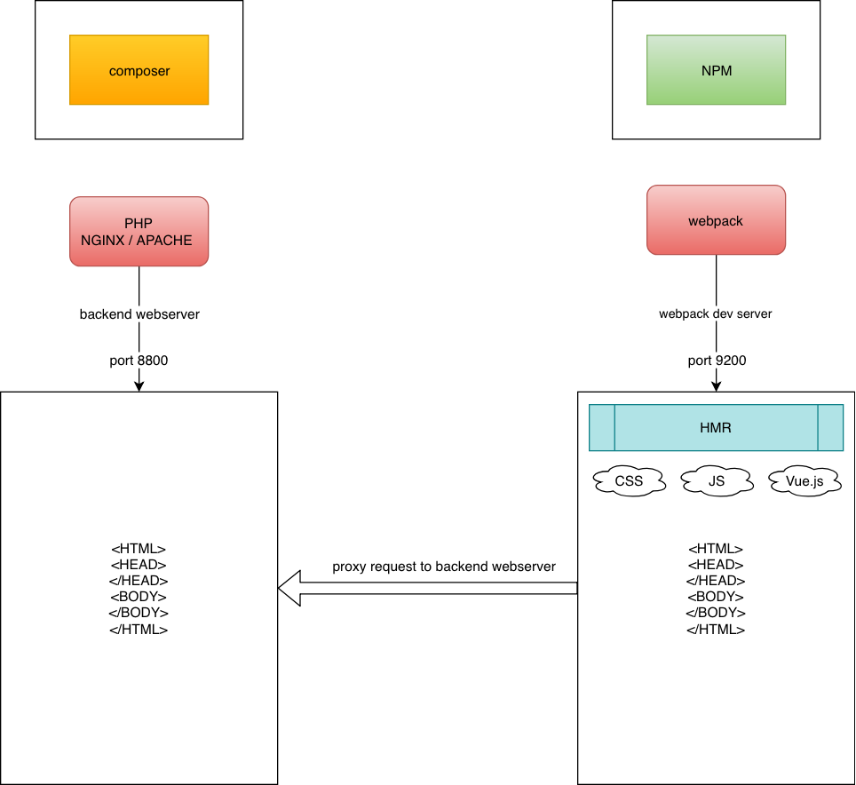

# Nette + Webpack + Vue.js

## Install

- `composer install`
- `npm install`

## Back-end

Type in terminals:

- `php -S 0.0.0.0:8000 -t www`
- open `localhost:8000`

## Front-end

- `npm run start` - generates development bundles
- `npm run watch` - watch changes in development bundles
- `npm run serve` - starts webpack development server
- `npm run build` - generates production bundles

## Front-end => Back-end

We gonna need webpack dev server and php dev server.

- `php -S 0.0.0.0:8000 -t www`
- `npm run serve`
- open `localhost:8080`

Or use make target:

- `make start`
- open `localhost:8080`

